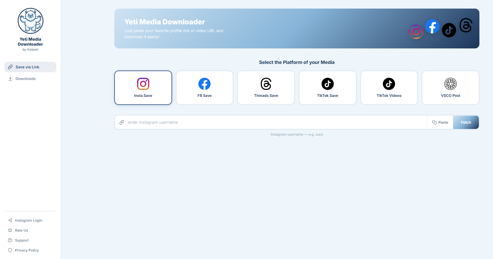

# Yeti Media Downloader

A sleek, all-in-one social media downloader that lets you save profile pictures, posts, reels, stories, and videos from multiple platforms — all from a single Vue-powered interface.



## Supported Platforms

| Platform | Features |
|----------|----------|
| **Instagram** | Profile pictures (HD), posts, reels, stories, highlights, carousel albums. Supports private profiles via login. |
| **Facebook** | Profile pictures and user info |
| **Threads** | Profile pictures, follower stats |
| **TikTok** | Profile pictures, **original 1080p no-watermark** video downloads (parses tikdownloader.io's HD anchor + decodes the snapcdn JWT to fetch the `_original.mp4` straight from TikTok's CDN — multi-extractor fallback to ssstik / mobile API / tikwm) |
| **VSCO** | HD image downloads from post URLs |

## Getting Started

### Prerequisites

- [Node.js](https://nodejs.org/) (v18 or higher recommended)

### Installation

```bash
# Clone the repository
git clone https://github.com/misterkailash/yeti_media_downloader.git
cd yeti_media_downloader

# Install dependencies
npm install
```

### Running the App

**Option 1 — Quick start (Windows):**

Double-click `start.bat`. It launches both servers and opens the app in your browser.

**Option 2 — Manual start:**

```bash
# Terminal 1: Start the API server
npm run server

# Terminal 2: Start the Vite dev server
npm run dev
```

The app will be available at `http://localhost:5173`.

**Production build:**

```bash
npm run build       # bundles to dist/
npm run preview     # previews the built app
```

### Optional: Instagram Session

For HD profile pictures and access to private profiles you follow, create a `.env` file in the project root:

```env
IG_SESSIONID=your_session_id_here
```

You can also log in directly from the app's sidebar.

## How to Use

1. **Select a platform** from the grid (Instagram, Facebook, Threads, TikTok, or VSCO)
2. **Enter a username or paste a URL** in the search bar (Instagram autocompletes as you type)
3. **Click Fetch** to load the profile or media
4. **Browse and download** — click on any post, story, or highlight to preview and download it

## Tech Stack

- **Frontend:** [Vue 3](https://vuejs.org/) (Composition API + `<script setup>` SFCs) with [Pinia](https://pinia.vuejs.org/) for state management
- **Build/Dev:** [Vite](https://vitejs.dev/) with HMR and an `/api` proxy to the backend (`vite.config.js` forwards `/api/*` to `localhost:3000`)
- **Backend:** Node.js + [Express 5](https://expressjs.com/), with [sharp](https://sharp.pixelplumbing.com/) for server-side WebP→JPEG transcoding
- **Styling:** Hand-rolled CSS with custom properties (navy/ice-blue palette pulled from the Yeti logo)

## Frontend Architecture

The UI is built around the **Composition API + `<script setup>`** for terse, type-friendly SFCs. State lives in Pinia stores, components stay presentational and pull reactive refs via `storeToRefs`. Every fetch flows through a store — components never call `fetch` directly — so loading/error/auth state stays consistent across the app.

```
SearchBar ─▶ search store ─▶ /api/<endpoint> ─▶ search store fills profile/video refs
                                                       │
                                                       ▼
                ProfileResult / VideoResult ◀── storeToRefs(searchStore)
                       │
                       ├──▶ posts store    (PostsGrid + PostModal carousel)
                       └──▶ stories store  (StoriesSection / HighlightsSection / StoryViewer)
```

**Components** (`src/components/`)
- Layout: `Sidebar`, `Hero`, `BackToTop`
- Search: `PlatformPicker`, `SearchBar` (with debounced Instagram autocomplete)
- Results: `ProfileResult`, `VideoResult`, `PostsGrid`, `StoriesSection`, `HighlightsSection`
- Modals: `PostModal` (carousel-aware), `StoryViewer` (prev/next chevrons + bulk-download for highlight reels)
- Status: `LoadingSpinner`, `ErrorBanner`, `AuthWarningBanner`

**Pinia stores** (`src/stores/`)
- `platform` — current platform + per-platform endpoint config (the single source of truth for "what does this query look up?")
- `search` — query, autocomplete debounce, profile/video result state, fetch orchestration
- `posts` — Instagram posts grid, infinite scroll cursor, post-modal/carousel state
- `stories` — stories, highlights, story viewer; bulk-download with progress refs (`dlAllRunning`, `dlAllDone`, `dlAllTotal`)
- `login` — Instagram session, 2FA flow, sidebar status
- `ui` — sidebar toggle, loading, error, auth warning banner
- `authHandler` — shared 401 handler for IG endpoints (clears session + raises the auth banner from one place)

## Backend Architecture

`server.js` is a single Express 5 app exposing the `/api/*` surface. It does three jobs:

1. **Public-data scrapers** — Instagram, Facebook, Threads, TikTok, VSCO. Each platform has a small set of endpoints (`/api/profile/:username`, `/api/ig-posts/:username`, `/api/tt-video?url=…`, etc.) that scrape the public HTML/og-tags or call public mobile APIs.
2. **CDN proxies with referer rewriting** — `/api/image-proxy`, `/api/tt-video-proxy`, etc. The browser can't fetch TikTok/Instagram CDN URLs directly (referer/CORS gates), so these proxies stream bytes through with the correct headers, optionally transcoding WebP→JPEG via `sharp` for downloads.
3. **Authenticated paths** — when an `IG_SESSIONID` is present, scrapers fall back to `i.instagram.com/api/v1/*` for HD assets and private-account access. Login + 2FA + checkpoint flows are handled in-process so the user never needs to touch the cookie jar manually.

**TikTok HD extraction (multi-source fallback chain).** TikTok's public `playAddr` is watermarked and capped at preview bitrate, so getting the `_original.mp4` requires bouncing through extractor sites that have signed mobile-API access. The chain is:

```
ssstik.io (parallel) ─┐
                      ├──▶ pick whichever returns an "HD" anchor first (decode snapcdn JWT)
tikdownloader.io ─────┘             │ both fail
                                    ▼
                          TikTok mobile API (musical_ly aid=1233)
                                    │ blocked
                                    ▼
                          tikwm.com (HD re-encode, ~720p)
                                    │ blocked
                                    ▼
                          TikTok web JSON (__UNIVERSAL_DATA__, watermarked)
```

`server.js` runs ssstik + tikdownloader concurrently with `Promise.all` and prefers any HD result. The HD button on tikdownloader points at `dl.snapcdn.app/get?token=<JWT>` whose payload is `{"url":"https://*.tokcdn.com/.../<id>_original.mp4?dl=1"}` — decoding the JWT skips the redirector entirely so the browser pulls the original MP4 straight from TikTok's CDN.

## Project Structure

```
yeti_media_downloader/
├── index.html              # Vite entry — mounts the Vue app
├── server.js               # Express API server (proxy, scraping, auth, transcode)
├── vite.config.js          # Vite + Vue plugin + /api proxy
├── package.json
├── start.bat               # One-click launcher (Windows)
├── .env                    # Session tokens (optional, not committed)
└── src/
    ├── main.js             # Vue + Pinia bootstrap, dynamic favicon
    ├── App.vue             # Root layout
    ├── assets/             # Logo, platform icons, global styles.css
    ├── components/         # 16 single-file components (see above)
    └── stores/             # 7 Pinia stores (see above)
```

## License

ISC

---

*Built by Kailash*
