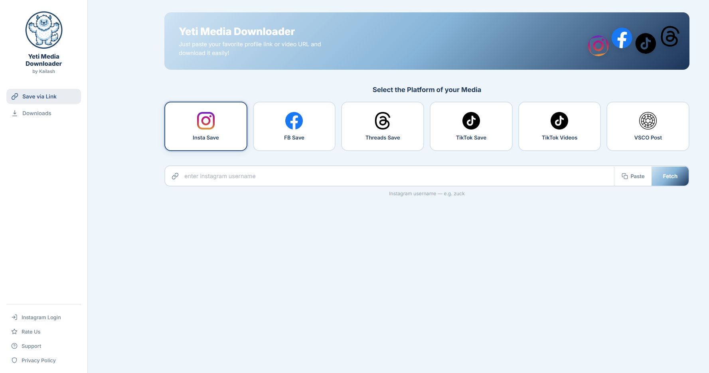

# Yeti Media Downloader

A sleek, all-in-one social media downloader that lets you save profile pictures, posts, reels, stories, and videos from multiple platforms — all from a single Vue-powered interface.



## Supported Platforms

| Platform | Features |
|----------|----------|
| **Instagram** | Profile pictures (HD), posts, reels, stories, highlights, carousel albums. Supports private profiles via login. |
| **Facebook** | Profile pictures and user info |
| **Threads** | Profile pictures, follower stats |
| **TikTok** | Profile pictures, watermark-free HD video downloads with codec/quality/size info |
| **VSCO** | HD image downloads from post URLs |

## Getting Started

### Prerequisites

- [Node.js](https://nodejs.org/) (v18 or higher recommended)

### Installation

```bash
# Clone the repository
git clone https://github.com/misterkailash/yeti_media_downloader.git
cd yeti_media_downloader

# Install dependencies
npm install
```

### Running the App

**Option 1 — Quick start (Windows):**

Double-click `start.bat`. It launches both servers and opens the app in your browser.

**Option 2 — Manual start:**

```bash
# Terminal 1: Start the API server
npm run server

# Terminal 2: Start the Vite dev server
npm run dev
```

The app will be available at `http://localhost:5173`.

**Production build:**

```bash
npm run build       # bundles to dist/
npm run preview     # previews the built app
```

### Optional: Instagram Session

For HD profile pictures and access to private profiles you follow, create a `.env` file in the project root:

```env
IG_SESSIONID=your_session_id_here
```

You can also log in directly from the app's sidebar.

## How to Use

1. **Select a platform** from the grid (Instagram, Facebook, Threads, TikTok, or VSCO)
2. **Enter a username or paste a URL** in the search bar (Instagram autocompletes as you type)
3. **Click Fetch** to load the profile or media
4. **Browse and download** — click on any post, story, or highlight to preview and download it

## Tech Stack

- **Frontend:** [Vue 3](https://vuejs.org/) (Composition API + `<script setup>` SFCs) with [Pinia](https://pinia.vuejs.org/) for state management
- **Build/Dev:** [Vite](https://vitejs.dev/) with HMR and an `/api` proxy to the backend
- **Backend:** Node.js + [Express 5](https://expressjs.com/), with [sharp](https://sharp.pixelplumbing.com/) for server-side WebP→JPEG transcoding
- **Styling:** Hand-rolled CSS with custom properties (navy/ice-blue palette pulled from the Yeti logo)

## Frontend Architecture

The UI is split into focused single-file components, each consuming Pinia stores via `storeToRefs`:

**Components** (`src/components/`)
- Layout: `Sidebar`, `Hero`, `BackToTop`
- Search: `PlatformPicker`, `SearchBar` (with debounced Instagram autocomplete)
- Results: `ProfileResult`, `VideoResult`, `PostsGrid`, `StoriesSection`, `HighlightsSection`
- Modals: `PostModal` (carousel-aware), `StoryViewer`, `LoginModal`
- Status: `LoadingSpinner`, `ErrorBanner`, `AuthWarningBanner`

**Pinia stores** (`src/stores/`)
- `platform` — current platform + per-platform endpoint config
- `search` — query, autocomplete, profile/video result state, fetch orchestration
- `posts` — Instagram posts grid, infinite scroll, post-modal/carousel state
- `stories` — stories, highlights, story viewer
- `login` — Instagram session, 2FA flow, sidebar status
- `ui` — sidebar toggle, loading, error, auth warning banner
- `authHandler` — shared 401 handler for IG endpoints

## Project Structure

```
yeti_media_downloader/
├── index.html              # Vite entry — mounts the Vue app
├── server.js               # Express API server (proxy, scraping, auth, transcode)
├── vite.config.js          # Vite + Vue plugin + /api proxy
├── package.json
├── start.bat               # One-click launcher (Windows)
├── .env                    # Session tokens (optional, not committed)
└── src/
    ├── main.js             # Vue + Pinia bootstrap, dynamic favicon
    ├── App.vue             # Root layout
    ├── assets/             # Logo, platform icons, global styles.css
    ├── components/         # 16 single-file components (see above)
    └── stores/             # 7 Pinia stores (see above)
```

## License

ISC

---

*Built by Kailash*
